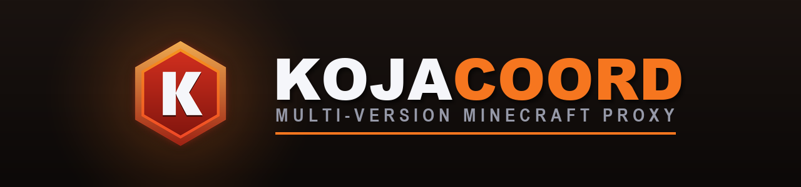

<div align="center">



[](https://www.kojacraft.net)
[](https://discord.gg/Xp6wFH3nM6)
[](https://opensource.org/licenses/MIT)
[](https://www.rust-lang.org)
[](https://crates.io/crates/kojacoord-proxy)
[](https://docs.rs/kojacoord-protocol)

</div>

Kojacoord is a multi-version proxy for Minecraft: Java Edition. It sits in
front of one or more backend servers, handles the handshake/login/encryption
with the client, and relays play traffic to the right backend — translating
protocol versions on the fly when the client and backend don't match. It's
written in Rust on Tokio, and it's the proxy that runs
[KojaCraft](https://www.kojacraft.net) in production.

**Status:** pre-1.0, actively developed. Protocol coverage spans 1.6.4
through 1.21.x, but verification depth varies by version — see [version
support](#version-support) before depending on a specific one.

## Contents

- [Features](#features)
- [Architecture](#architecture)
- [Building](#building)
- [Configuration](#configuration)
- [Running](#running)
- [Version support](#version-support)
- [Metrics](#metrics)
- [Plugins](#plugins)
- [Security model](#security-model)
- [Contributing](#contributing)
- [License](#license)
- [Protocol sources](#protocol-sources)

## Features

- Protocol support for 1.6.x through 1.21.x, mapped onto canonical
  per-version buckets — see [version support](#version-support).
- Rule-based routing (username glob or client IP/CIDR), GeoIP region
  selection, failover groups with automatic failback, and per-server TCP
  health checks.
- Full-server connection queueing instead of hard rejection, and
  weighted/least-connections/latency-aware selection across named backend
  pools (`[[server_groups]]`).
- Limbo: a synthetic holding world for players when no backend is reachable,
  instead of a disconnect.
- Online-mode auth against Mojang's session servers with profile-signature
  verification, offline mode, Velocity (HMAC-signed) and legacy BungeeCord
  player-info forwarding.
- Per-IP connection throttling and a pluggable IP-reputation blocklist
  (static CIDRs plus an optional external provider).
- A WASM plugin system — typed guest SDK, host-side event hooks, Redis and
  outbound HTTP access. See [Plugins](#plugins).
- Redis-backed clustering for running multiple proxy nodes.
- Hot config reload, gzip log rotation, graceful shutdown with a configured
  disconnect reason, GameSpy4/UT3 query support, server-list favicon, and a
  Prometheus metrics endpoint.
- No database, no admin HTTP surface, by design — see [Metrics](#metrics).

## Architecture

The workspace is split into focused crates:

| Crate | Responsibility |
| ----- | -------------- |
| `kojacoord-protocol` | Packet types, codecs and per-version registries |
| `kojacoord-netty` | Framing, compression and encryption codec layer |
| `kojacoord-auth` | Session authentication and login-phase encryption |
| `kojacoord-proxy-core` | Core proxy: sessions, relay, routing, limbo, realms, control planes |
| `kojacoord-config` | Configuration schema, loading and validation |
| `kojacoord-api` | Public API surface for plugin development |
| `kojacoord-plugin-abi` | Wire types shared by the plugin host and guest SDK |
| `kojacoord-plugin-sdk` | Guest SDK for writing WASM plugins |
| `kojacoord-plugin-system` | Plugin loading, lifecycle and host API |
| `kojacoord-cluster` | Redis-backed cluster coordination |
| `kojacoord-metrics` | Prometheus metrics collection and exporter |

## Building

You'll need Rust 1.92+ and `protoc` (the Protocol Buffers compiler — it's
needed to build the gRPC control plane).

```bash
git clone https://github.com/KojaCraft/kojacoord.git
cd kojacoord-proxy

# Release build (recommended for actually running the proxy)
cargo build --release
# Binary ends up at target/release/kojacoord-proxy

# Development build + tests
cargo build
cargo test
```

## Configuration

On first run, if there's no config file, Kojacoord writes a default
`config.toml`, generates strong random tokens for anything enabled that
needs one, and prompts once to accept the Minecraft EULA. Pass a different
path as the first argument if you'd rather keep it elsewhere:
`kojacoord-proxy /path/to/config.toml`.

Secrets can also come from environment variables instead of the file — use
a `KOJA_` prefix and `__` for nesting, e.g. `KOJA_SERVER_MANAGEMENT__AUTH_TOKEN`
or `KOJA_FORWARDING__VELOCITY_SECRET`.

Here's a minimal one to get a feel for the shape of it:

```toml
[proxy]
bind = "0.0.0.0:25565"
online_mode = true
compression_threshold = 256
max_players = 1000
session_timeout_secs = 5

[listeners]
motd = "KojacoordNetwork"
tab_list = "GLOBAL_PING"     # GLOBAL_PING | SERVER_PING | HIDDEN

[forwarding]
mode = "none"                # none | velocity | bungeecord
velocity_secret = ""         # required for velocity; e.g. `openssl rand -hex 32`

[geoip]
database_path = ""           # optional MaxMind GeoLite2 .mmdb path; empty = region routing off

[telemetry]
enabled = true               # set false to disable usage telemetry entirely
interval_secs = 1800

[[servers]]
name = "lobby"
address = "127.0.0.1:25566"
display_name = "Lobby"
game_type = "lobby"

[[servers]]
name = "survival"
address = "127.0.0.1:25567"
backend_type = "spigot"      # spigot | forge | hybrid
display_name = "Survival"
max_players = 100
```

Most of this hot-reloads when the file changes; a few fields need a
restart. The generated default config has per-field comments noting which
is which, so that's the source of truth if this snippet and the code ever
drift apart.

## Running

```bash
# Run the release binary
./target/release/kojacoord-proxy

# Or via Cargo
cargo run --release
```

Config changes are picked up automatically on save, or on `SIGHUP` (Unix).
Ctrl+C (or `SIGTERM`/`SIGQUIT`) triggers a graceful shutdown that disconnects
players with a configured reason instead of just dropping the socket.

Drop a `favicon.png` (64×64, standard Minecraft server-icon format) next to
the binary and it's sent in the server-list ping — no config needed. A
missing or invalid file is logged and skipped; it's re-checked on the same
reload/SIGHUP as the MOTD, so swapping it out doesn't need a restart either.

## Version support

Every client version maps onto a **canonical bucket** — the concrete
typed-packet implementation that drives limbo and protocol handling for that
family. A few patch releases share a protocol number (1.19.1 and 1.19.2 are
both 760, for instance), so they collapse onto one row below.

"Tested" means someone actually verified it end-to-end against a real
vanilla client: reaches the limbo spawn, the chat/sound/abilities/keep-alive
loop holds up, and the proxy can disconnect it gracefully with a real reason.

| Version family | Canonical bucket | Status |
| -------------- | ---------------- | ------ |
| 1.6.x          | `V1_6_4`         | Tested |
| 1.7.x          | `V1_7_10`        | Tested |
| 1.8.x          | `V1_8`           | Tested |
| 1.9.x – 1.12.x | `V1_12_2`        | 1.12 tested · 1.9–1.11 tested |
| 1.13.x – 1.16.x| `V1_16_5`        | Tested |
| 1.17.x – 1.19.x| `V1_19_4`        | Tested |
| 1.20.x         | `V1_20_4`        | 1.20 / 1.20.1 tested · 1.20.2+ tested |
| 1.21.x         | `V1_21`          | Tested |
| 1.26.x         | `V26`            | Tested |

One wrinkle worth knowing about: limbo's registry handling differs by
protocol era. Protocols ≤ 763 (1.16–1.20.1) get the registry codec embedded
directly in the join packet; 1.20.2–1.20.4 (764/765) fall back to whatever
registries the client already has built in; and 1.20.5+/1.21 (766+) get
explicit `RegistryData` captured from `minecraft-data`. The void-chunk /
set-center-chunk trick that clears the "Loading terrain" screen currently
covers the `V1_19_4` bucket, with `V1_20`/`V1_21` being extended.

Protocol conversion between client and backend versions happens
automatically during relay — the 1.6.x ↔ 1.12.2 converter pair covers the
gameplay packet set bidirectionally, and framing is pre-netty-aware so 1.6
clients get raw `[id][body]` packets while modern backends get
varint-length-framed, compressed ones.

The public roadmap — including things like Bedrock bridging and a Realms
compatibility layer that are still in progress — lives in
[`ROADMAP.md`](ROADMAP.md).

## Metrics

Kojacoord holds no persistent state and exposes no inbound admin HTTP
surface. The only thing it listens on over HTTP is a read-only Prometheus
endpoint (`metrics.enabled = true`, default bind `127.0.0.1:9090`). Bans,
mutes, warnings, ranks and permissions are left to a plugin — the proxy
relays packets, it doesn't manage player data.

## Plugins

Plugins are WebAssembly modules. You depend on `kojacoord-plugin-sdk` and
`kojacoord-plugin-abi`, implement the `Plugin` trait, and call
`export_plugin!` once — the macro takes care of the C ABI exports the host
expects and the JSON marshalling underneath.

The host exposes logging, config access, proxy commands (register/deregister
servers, transfer or kick players, broadcast messages), a Redis client
family, and outbound HTTP. Plugins subscribe to a bitmask of events — joins,
leaves, chat, movement, server connect/switch/kick, server-list pings,
plugin messages, Redis messages, and more.

```rust
use kojacoord_plugin_sdk::*;

struct MyPlugin;

impl Plugin for MyPlugin {
    fn on_enable(&mut self) {
        log(LogLevel::Info, "hello from wasm");
        redis_connect(&get_config("redis_url").unwrap_or_default());
        redis_subscribe("kojacoord:sanctions");
    }

    fn handle_event(&mut self, ev: &PluginEvent) -> Option<PluginResponse> {
        if let PluginEvent::RedisMessage { channel, payload } = ev {
            log(LogLevel::Info, &format!("{channel}: {payload}"));
        }
        None
    }
}

export_plugin!(MyPlugin, MyPlugin);
```

Set `plugins.hot_reload = true` and the plugin directory gets polled, with
modules reloaded as their files change.

## Security model

- **Login encryption.** Online-mode login uses RSA key exchange followed by
  AES-CFB8 packet encryption, matching the vanilla protocol.
- **Identity verification.** Profile property signatures are checked against
  the configured Mojang public key, so a MITM can't forge a skin/cape onto a
  session.
- **Forwarding secrets.** Velocity forwarding is HMAC-signed and validated at
  startup — empty, too-short, or well-known placeholder secrets are rejected
  outright. Legacy BungeeCord forwarding is unsigned by design; if you use
  it, your backends need to be firewalled to only accept connections from
  the proxy.
- **Control-plane internode encryption.** Separate from Minecraft login
  encryption entirely: a pluggable cipher registry offers AES-256-GCM,
  ChaCha20-Poly1305 and XChaCha20-Poly1305 for internode/control-plane
  payloads, plus room to register custom algorithms. An optional
  `post-quantum` feature adds a real ML-KEM-768 (NIST FIPS 203) +
  AES-256-GCM hybrid via RustCrypto's `ml-kem` — off by default, and it's a
  KEM+DEM hybrid only (not paired with a classical KEM), so combine it with
  a classical cipher if you need classical/PQ hybrid guarantees.
- **Crash reports.** Written IP-redacted and stripped of tokens/keys, so
  they're safe to attach to a bug report as-is.

## Contributing

1. Fork the repo and branch off `main`.
2. Make your change — try to keep it consistent with the code around it.
3. Run `cargo fmt`, `cargo clippy`, and `cargo test` before you push.
4. Add tests for new behavior and rustdoc for anything public.
5. Open a PR describing what changed and why.

See [CONTRIBUTING.md](CONTRIBUTING.md) for the full guidelines and
[CODE_OF_CONDUCT.md](CODE_OF_CONDUCT.md) for the code of conduct. When
filing a bug, include the proxy version, client/backend versions, a
redacted config, relevant logs, and steps to reproduce.

## License

MIT — see [LICENSE](LICENSE).

Copyright (c) 2026 KojaCraft.

## Protocol sources

Built against these references:

- [Minecraft Wiki — Java Edition protocol](https://minecraft.wiki/w/Java_Edition_protocol/Packets) — packet documentation and version history
- [PrismarineJS minecraft-data](https://github.com/PrismarineJS/minecraft-data) — protocol data and mappings
- [ProtocolSupport](https://github.com/ProtocolSupport/ProtocolSupport) — reference for legacy protocols
